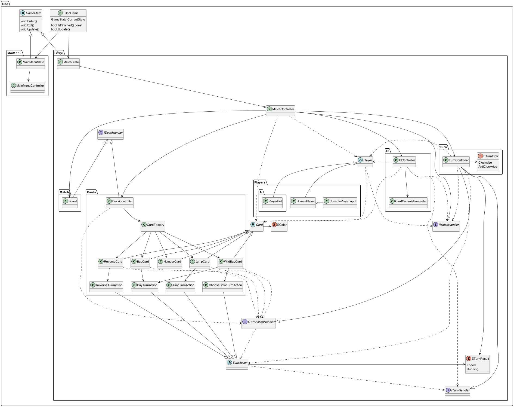
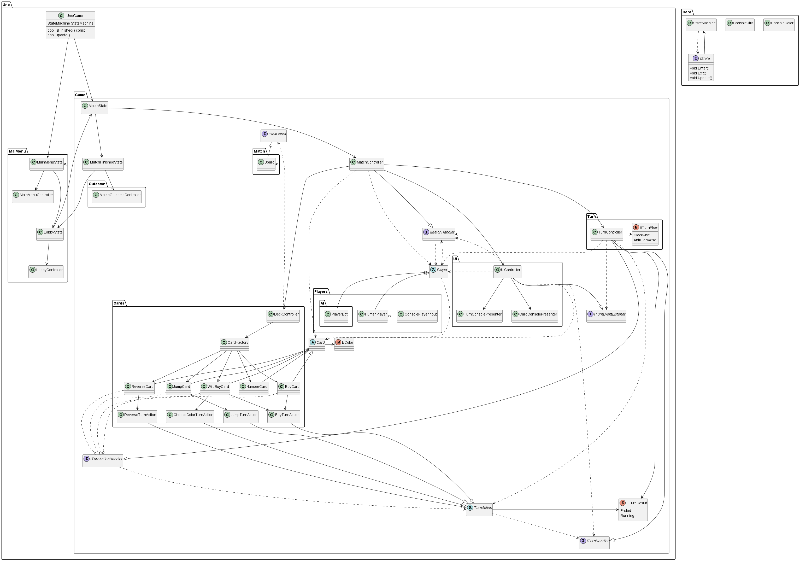

# Cpp-Uno
 Uno game made in C++ using Windows console as user interface to practice the language.

## Uno Rules

This project will follow some of the [original rules](https://www.unorules.org/wp-content/uploads/2021/03/Uno-Rules-PDF-Official-Rules-unorules.org_.pdf) of the game, with some simplifications for now:

* Players only buy cards when none can be used, instead of the original rule of buying in any turn;
* First player chooses the first card to be placed on the table, instead of dealer placing the first from deck;
* No solo wildcard, just the +4 wildcard;
* No scoring.

The rules cut is to spare some time for the intended deadline. Missing rules will be added on the future.

## Setup

The solution was created using [Rider](https://www.jetbrains.com/pt-br/rider/) and [Visual Studio](https://visualstudio.microsoft.com/pt-br/vs/community/) toolset for compiling the project. If you don't have any of those IDE, a separate compiler will be required to run the project, such as CMake.

### Rider
* Make sure you have [Visual Studio](https://visualstudio.microsoft.com/pt-br/vs/community/) installed with C++ desktop development checked during installation (Rider uses this toolset for compiling);
* Open `Uno.sln` solution;
* On topmost right corner, use the play button to run the 'Uno' project.

## Architecture

### How it started
* Simple state machine approach for handling game states (main menu, playing a match);
* Actions to handle pre-turn and post-turn situation (next player needs to buy cards, skip this player turn);
* Abstraction on player to handle creating a player bot on the future.

### How it ended
* Created a core package with utilities and a state machine;
* Created interface ITurnEventHandler so UI can show a message when turn has been reversed or skipped;
* New states and controllers for Main Menu, Lobby and Match Ended.

## What could have been done better?

### Too much classes and inheritance on cards
All cards could have had an array of actions to perform when the `Use()` method is called. This actions could be created by the factory and passed to the Card (we could also apply some lightweight pattern here).
We would also need to rethink the `ToShortString()` and `CanStackOn` to not need the specialized versions, or at least create fewer versions (such as a `NumberCard` and `SpecialCard` only). 

### Better way of creating and customizing cards
Right now we would need to dive into the code to change cards behaviour and how many of them we should create. Reading a configuration file and creating cards based on it would make quick changes a lot easier. We could also have different deck configurations, such as playing with number cards only, a deck with more chaotic cards and so on. Would also make it easier to test cards on runtime.

### Better overall settings
Same idea from the previous topic. Instead of having some `constexpr` spread around headers, a configuration file for it would have been a better approach, containing for instance how many cards players start and any other relevant variable that would be cool to tweak by designers.

### Add cheats
Add cheats for quick tests on runtime, such as force match end with a specific winner, give a certain card to player and so on.

### Better input mapping with actions
One of the main goals for the architecture decision of this project was making it easier to change later on for a graphics lib, instead of using the console. I believe how the player input is set up right know would need some refactoring, as it has some specifics methods that only works for a console approach, like `GetSelectedCardIndex()`. A better approach would be having some kind of input mapping to bind actions to it. We could also pass this mapping to the UI so it could render the available inputs and descriptions instead of having it hard coded.
Adding this change to handling UI with navigation (pressing keys to select an item) would also be cooler.

### Cyclic reference between `IMatchHandler` and `Player`
There is a cyclic reference between `IMatchHandler` which needs to know `Player` to perform some actions on it, as well as passing it around to UI, and `Player` which needs to know `IMatchHandler` to ask if their action is valid and to do that (such as using a `Card`).
One way of avoiding that would be by adding an action approach to player, such as `ChooseCardAction` (based on an abstract `Action`) which knows about `IMatchHandler` created by a higher class and passed to player. Player would check if `action.CanExecute()` and then `Execute()` it. Another approach would be creating a new interface between then. 

### Create an event bus
It would make it easier to react to some card and turn events and would also open the possibility of adding new cool stuff without the need of refactoring and creating new interfaces. The `ITurnEventListener` is an example of that, it only exists due the fact the UI needs to show some message when turn has been reversed or skipped.

### Better memory clean up on inactive states
All states use a Controller to update the game with the desired behavior and for checking if we should transition to another state. Some of them are not fully cleaned when not active, leaving memory allocated on stack for their Controller. The only one that is currently fully release is the `MatchController`, which is created as `shared_ptr` and reset on exiting the state. We could use the same idea on other states controllers or fully removing the state from the state machine when exiting.

### More polishing
Make the game prettier, such as adding a cool card presentation with a frame around it, some logo with ASCII art on main menu, clear and juicier turn events (turn skipped, UNO yelled...) and so on.

